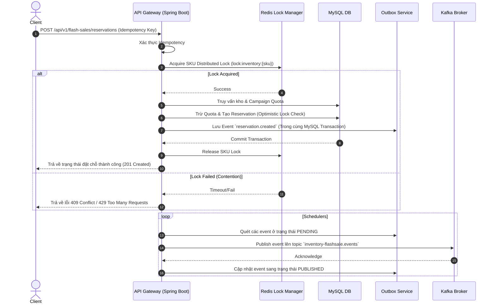

# 🚀 Omnichannel Inventory & Flash Sale Concurrency Engine

[](https://openjdk.org/)
[](https://spring.io/projects/spring-boot)
[](https://redis.io/)
[](https://kafka.apache.org/)
[](https://www.mysql.com/)
[](https://react.dev/)

Một hệ thống **Modular Monolith** hiệu năng cao xử lý nghiệp vụ đặt giữ chỗ tồn kho (inventory reservation) và chiến dịch flash sale đa kênh (omnichannel). Hệ thống được thiết kế đặc biệt nhằm giải quyết triệt để vấn đề **overselling (bán quá số lượng)**, độ lệch tồn kho giữa các sàn TMĐT (Shopee, TikTok Shop), đồng thời đảm bảo tính nhất quán dữ liệu dưới tải cao thông qua kiểm tra hiệu năng định kỳ.

---

## 🌟 Tính Năng Cốt Lõi

| Nghiệp Vụ | Giải Pháp Kỹ Thuật | Ý Nghĩa Thực Tế |
|---|---|---|
| **An Toàn Concurrency** | Kết hợp **Redis Distributed Lock** theo SKU và **Optimistic Locking** (`@Version` JPA). | Ngăn chặn overselling khi hàng nghìn người cùng tranh mua 1 SKU Hot. |
| **Giao dịch Tin cậy** | **Transactional Outbox Pattern** kết hợp sự kiện bất đồng bộ qua **Apache Kafka**. | Đảm bảo tính nhất quán dữ liệu giữa DB MySQL và Kafka, tránh mất mát sự kiện. |
| **Đồng bộ Đa Kênh** | Cơ chế Snapshots, Sync Attempts và đối soát lệch tồn kho (Reconciliation). | Quản lý độ lệch tồn kho và đồng bộ trạng thái thực tế lên TikTok Shop, Shopee. |
| **Độ tin cậy Tuyệt đối** | Đảm bảo tính **Idempotency** (trùng lặp request) qua cơ chế bảng kiểm tra giao dịch độc lập. | Tránh nhân đôi giao dịch đặt hàng hoặc hoàn tiền khi client gửi trùng gói tin HTTP/Webhook. |
| **Bảng Điều Hành Admin** | Single Page Application bằng **React + Vite + TypeScript**. | Giao diện điều hành trực quan quản lý chiến dịch, đối soát lệch kênh và xem kết quả benchmark. |

---

## 📐 Kiến Trúc Luồng Đặt Chỗ (Reservation Flow)

Quy trình dưới đây mô tả cách hệ thống đảm bảo tính nhất quán từ khâu kiểm tra tồn kho, khóa phân tán cho đến khâu xuất bản sự kiện bất đồng bộ qua Outbox:



---

## 📊 Số Liệu Thực Tế (Project Metrics)

Dự án được xây dựng với cấu trúc kiểm thử chặt chẽ và các số liệu kỹ thuật thực tế đạt được:

* **Mã Nguồn Backend**: Chia nhỏ thành **6 modules** độc lập nghiệp vụ (`common`, `channel`, `flashsale`, `inventory`, `order`, `outbox`) quản lý qua Maven Reactor.
* **REST API**: **39 REST Endpoint Handlers** hỗ trợ đầy đủ từ admin quản trị đến cổng ingress webhook cho TikTok.
* **Cơ Sở Dữ Liệu**: **15 bảng** quản lý lịch sử thông qua **20 Flyway migrations** đảm bảo tính nhất quán schema.
* **Kiểm Thử Tự Động**: **75 Unit/Integration tests** (Backend) chạy giả lập trên **Testcontainers** và **32 Test Cases** (Frontend SPA) chạy Playwright E2E/Vitest.
* **Khả Năng Chịu Tải (K6 Benchmarks)**:
  - Vượt qua 5 kịch bản tải mô phỏng Hot SKU Contention, Flash Sale Window, Reservation Expiry, Outbox Recovery, và Reconciliation Load.
  - Thời gian xử lý trung bình dao động từ **5.57ms** (Outbox) đến **164.13ms** (Hot SKU dưới tải tranh chấp cực cao), tỷ lệ lỗi đạt **0.00%**.

---

## 📂 Cấu Trúc Repository

```text
├── apps/
│   ├── api/             # Mã nguồn Spring Boot deployable app (Cổng API chính)
│   └── admin-ui/        # Giao diện React SPA điều khiển chiến dịch & đối soát
├── modules/
│   ├── common/          # Tiện ích dùng chung, định dạng thời gian & xử lý ngoại lệ
│   ├── channel/         # Lớp trừu tượng hóa kênh bán hàng & Connector Shopee/TikTok
│   ├── flashsale/       # Quản lý chiến dịch, phân bổ hạn ngạch (quota)
│   ├── inventory/       # Nghiệp vụ tồn kho vật lý và đặt giữ chỗ (Reservation)
│   ├── order/           # Bộ khung quản lý vòng đời đơn hàng
│   └── outbox/          # Triển khai Transactional Outbox & Publish Kafka
├── testing/
│   ├── k6/              # Các kịch bản tải đo đạc độ trễ và khả năng oversell
│   └── contracts/       # Contract kiểm thử cấu trúc event đầu ra của Outbox
```

---

## 🛠️ Hướng Dẫn Chạy Dự Án (Getting Started)

### 1. Yêu Cầu Hệ Thống
- Java 21 SDK
- Node.js 20+ & npm
- Docker & Docker Compose

### 2. Khởi Chạy Cơ Sở Hạ Tầng (Infrastructure)
Khởi chạy MySQL, Redis, Kafka, và Kafka-UI cục bộ qua compose:
```bash
docker compose up -d
```

### 3. Chạy Ứng Dụng Backend
```bash
./mvnw spring-boot:run -pl apps/api
```
*API Swagger UI sẽ có sẵn tại: `http://localhost:8080/swagger-ui.html`*

### 4. Chạy Giao Diện Admin UI
```bash
cd apps/admin-ui
npm install
npm run dev
```
*Giao diện điều khiển mở tại: `http://localhost:3000`*

### 5. Chạy Kiểm Thử Tải (K6 Load Tests)
```bash
k6 run ./testing/k6/hot-sku-contention.js
```

---

## 📈 Quy Trình CI/CD (GitHub Actions)
Hệ thống tích hợp quy trình kiểm thử và deploy tự động:
- **CI (Continuous Integration)**: Tự động chạy toàn bộ linter, unit tests, integration tests qua Testcontainers, build gói Maven và chạy Playwright frontend. Sau đó đóng gói Docker image push lên **GitHub Container Registry (GHCR)**.
- **CD (Continuous Deployment)**: Lắng nghe trạng thái của CI, tự động SSH vào VPS đích, thực hiện pulling image mới nhất và chạy khởi tạo lại dịch vụ qua Docker Compose (`cd.yml`).
