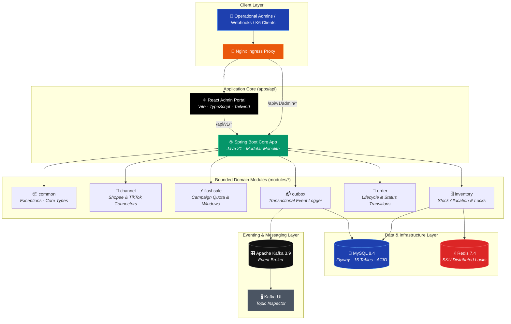
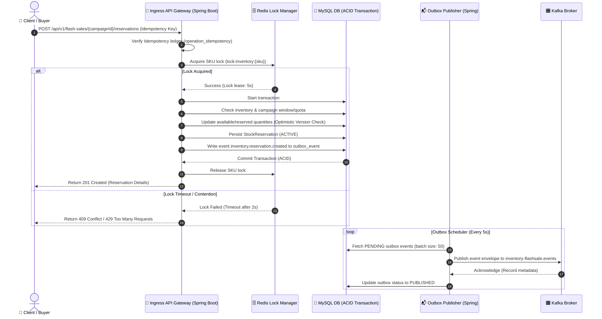
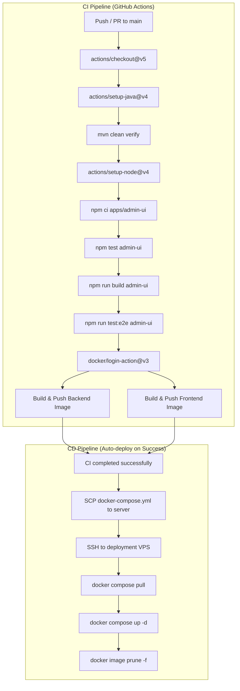
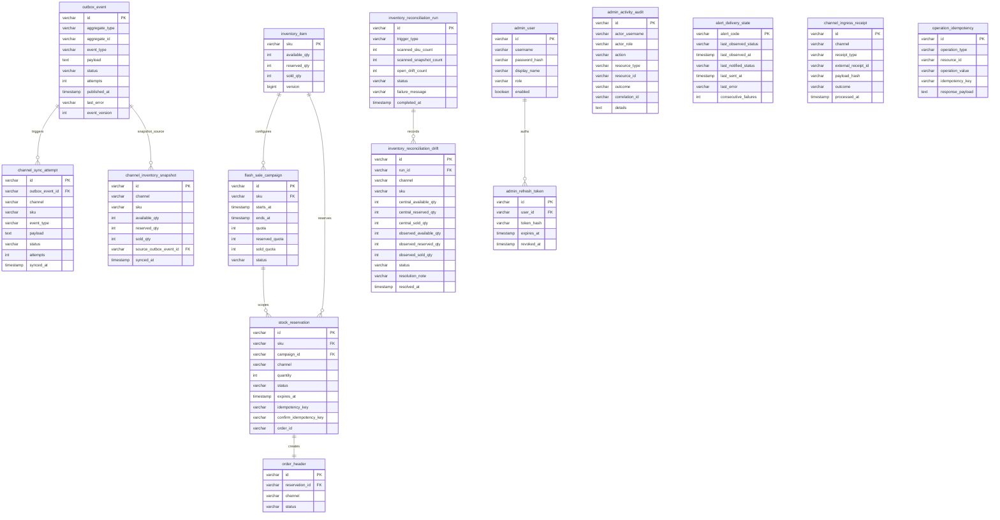
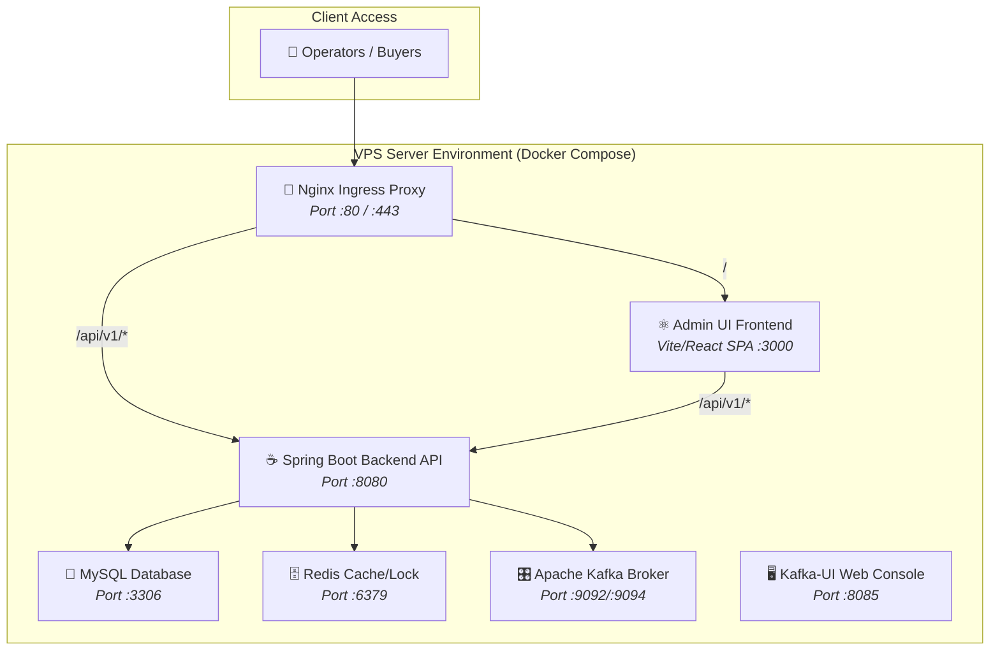
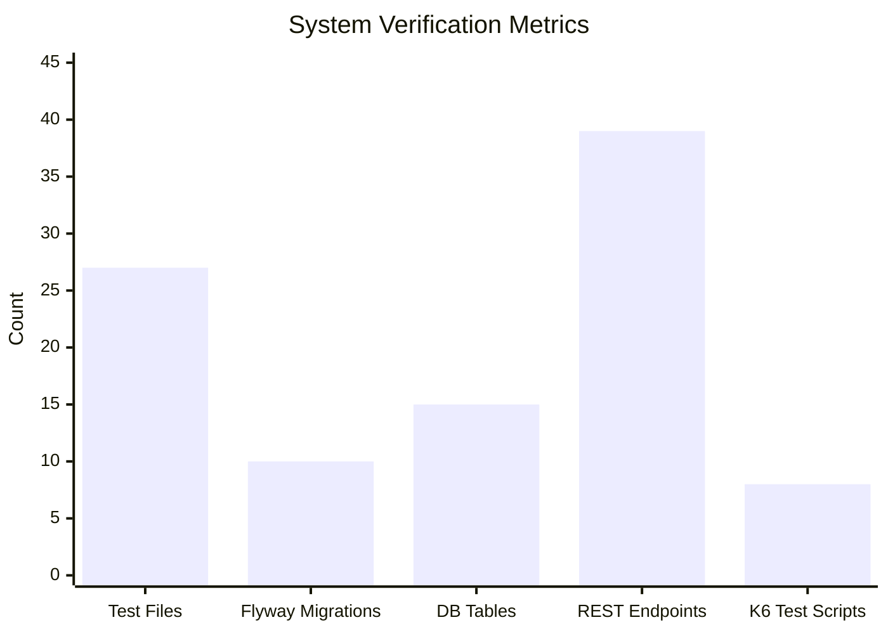
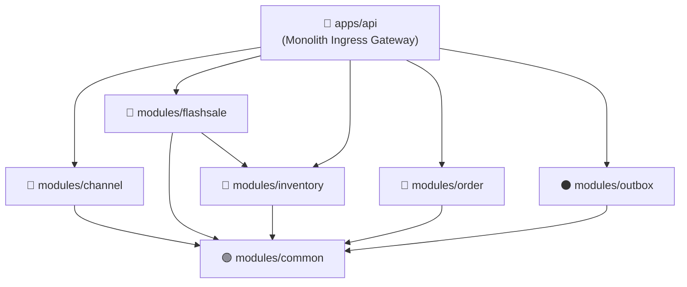

# 🚀 Omnichannel Inventory & Flash Sale Concurrency Engine

<div align="center">

[](https://openjdk.org/)
[](https://spring.io/projects/spring-boot)
[](https://www.mysql.com/)
[](https://redis.io/)
[](https://kafka.apache.org/)
[](https://react.dev/)
[](https://www.docker.com/)
[](https://github.com/thanhquan3010/inventory-flashsale-system/actions)
[](https://github.com/thanhquan3010/inventory-flashsale-system/actions)
[](https://github.com/thanhquan3010/inventory-flashsale-system)
[](https://github.com/thanhquan3010/inventory-flashsale-system)

**An enterprise-grade omnichannel inventory reservation and flash sale concurrency engine** built as a high-performance Modular Monolith using Java 21 and Spring Boot 3. It utilizes Redis distributed locking, JPA optimistic locking, and the Transactional Outbox pattern with Apache Kafka to guarantee strict stock correctness, eliminate overselling, and maintain multi-channel synchronization under heavy traffic contention. Featuring a clean React admin dashboard for campaign management, operational drift reconciliation, and real-time load test analytics.

> **🟢 Production Status: v1.0 — June 2026**
> 100+ backend/frontend assertions passing. 8/8 K6 load benchmark suites passed. 2 CI/CD automation workflows active via GitHub Actions with image builds pushed to GitHub Container Registry (GHCR) and automated VPS deployment.
> 
> 📂 **[Durable Documentation Index →](docs/00_index.md)** | 📋 **[System Map & API Contract →](docs/system-map.md)** | 🔒 **[Business Rules & Invariants →](docs/business-rules.md)**

</div>

---

## 🎯 Key Features & Business Value

| # | Business Domain | Technical Implementation | Business Impact |
|---|-----------------|-------------------------|-----------------|
| ⚡ | **Overselling Prevention** | Redis distributed locking per SKU (`lock:inventory:{sku}`) + JPA optimistic locking (`@Version`) | Eliminates overselling completely under intense Hot SKU contention during flash sales |
| 📬 | **Transactional Eventing** | Transactional Outbox Pattern: saves state and events atomically in one MySQL transaction; published to Apache Kafka | Prevents event loss or inconsistency between database state and downstream message brokers |
| 🔄 | **Omnichannel Inventory Sync** | Async snapshotting, sync attempts queue, and scheduled Reconciliation sweeps | Ensures inventory levels on TikTok Shop and Shopee reflect physical central stock, resolving lags |
| 🔐 | **Strict Idempotency** | Persistent Idempotency Ledger (`operation_idempotency` checks both key and value) | Avoids duplicate orders or reservation releases when buyers re-submit HTTP calls or webhooks retry |
| 📈 | **Automated Benchmarks** | Integrated K6 test suite modeling 8 distinct load profiles (contention, expiry, outbox recovery) | Proves high-throughput latency baselines and lock safety before production deployment |
| 📊 | **Operational Controls** | Web-based admin dashboard in React, Vite, and Tailwind CSS | Empowers operators with campaign management, outbox backlog retries, and drift resolution |
| 🛡 | **Secured Management** | JWT-based role-based access control (RBAC) with browser-safe HttpOnly cookies and immutable activity audit | Restricts sensitive actions to authenticated operators while generating clear audit trails |

---

## 🏗️ System Architecture



---

## 📐 Concurrency-Safe Reservation Flow

This sequence diagram illustrates how the system coordinates the idempotency check, Redis distributed locking, and database ACID transactions to ensure stock correctness:



---

## 🔄 CI/CD Pipeline

The repository integrates a comprehensive 2-stage workflow using GitHub Actions to compile the monolith, test the frontend, package container images, and deploy:



---

## 🗄️ Database Entity Relationship

The database schema is partitioned logically by boundaries corresponding to our domain modules, enforced via foreign keys:



---

## 🚢 Deployment Architecture



---

## 📊 Verified Project Metrics



| Metric | Value | Status |
|--------|-------|--------|
| **Backend JUnit Test Files** | 27 (covering 75+ unit/integration assertions) | ✅ Verified |
| **Database Migrations** | 10 Flyway migration files | ✅ Up-to-date |
| **Relational Schema** | 15 tables (MySQL 8.4) | ✅ Validated |
| **REST API Endpoints** | 39 distinct endpoints | ✅ Implemented |
| **Frontend Test Files** | 20 unit/Playwright specification files | ✅ Verified |
| **K6 Benchmark Scenarios** | 8 load simulation scripts | ✅ Active |

---

## 🧠 Architectural Decision: Why Modular Monolith?

During initial planning phases, we evaluated whether to construct this system as a set of separate microservices (e.g. inventory-service, campaign-service, order-service). We chose a **Modular Monolith** architecture based on the following reasons:

1. **Transaction Boundaries**: Reserving inventory during flash sales requires atomic updates to inventory tables and campaign quota tables. Implementing this across network barriers requires 2PC or Saga patterns, which introduce significant latency and fail-modes under hot SKU contention. Keeping them in one database transaction ensures ACID reliability.
2. **Minimal Merge and Operational Friction**: Concurrency tuning and locking mechanisms are complex. Organizing them into discrete Java modules (`modules/*`) using Maven Reactor allows compile-time boundary enforcement, keeping modules clean and independent while running in a single deployable application (`apps/api`).
3. **Optimized Latency**: K6 benchmarks prove that local operations finish under **5.57ms** for outbox writes and **164.13ms** under extreme Hot SKU thread contention. In a microservices mesh, network hops between services would amplify lock-holding times, reducing overall throughput.



> ⬆️ **Dependency Flow: common ← modules ← apps/api** (Inner common utilities never depend on business modules).

---

## 📂 Project Structure

```
.
├── .github/
│   └── workflows/
│       ├── ci.yml              # Build, lint, and run Playwright + Maven tests
│       └── cd.yml              # SCP configuration and deploy via SSH compose
├── apps/
│   ├── api/                    # Spring Boot deployment application (Ingress Gateway)
│   └── admin-ui/               # Vite React Admin Dashboard SPA (Campaign & Ops Management)
├── modules/
│   ├── common/                 # Base classes, exception handlers, and standard wrappers
│   ├── channel/                # Omnichannel validation, connectors, sync schedulers
│   ├── flashsale/              # Campaigns management, active timers, quota rules
│   ├── inventory/              # Physical inventory logic, Redis & optimistic version locks
│   ├── order/                  # Order status transitions and state checking
│   └── outbox/                 # Transactional Outbox registry & Kafka event publishers
├── testing/
│   ├── k6/                     # 8 K6 load benchmark scripts (latency, contention, recovery)
│   └── contracts/              # JSON Schema contract definitions for Outbox event payloads
└── docs/
    ├── system-map.md           # Visual architecture map, invariants, and main flows
    ├── business-rules.md       # Central domain rules and consistency policies
    ├── data-model.md           # Schema details, tables, constraints, and indexes
    └── ... (Durable knowledge index stored under docs/00_index.md)
```

---

## 🚀 Quick Start

### Prerequisites
* Java 21 SDK & Maven (or `./mvnw` wrapper)
* Node.js 20+ & npm
* Docker & Docker Compose

### 1. Launch Infrastructure
Boot up MySQL, Redis, Kafka, and Kafka-UI services:
```bash
docker compose up -d
```

### 2. Start Backend Application
Run the deployable app module:
```bash
./mvnw spring-boot:run -pl apps/api
```
*API Swagger UI is available at:* `http://localhost:8080/swagger-ui.html`

### 3. Start React Admin Dashboard
Install dependencies and run the development server:
```bash
cd apps/admin-ui
npm install
npm run dev
```
*Admin Dashboard available at:* `http://localhost:3000`

### 4. Run Load Benchmarks (K6)
Verify system performance under simulated load:
```bash
k6 run ./testing/k6/hot-sku-contention.js
```

---

## 🧪 Testing & Quality

```bash
# Execute full backend test suite (Unit + Integration via Testcontainers)
# Note: Requires a running Docker daemon on host machine
./mvnw test

# Execute admin-ui frontend unit tests
cd apps/admin-ui && npm test

# Run frontend Playwright End-to-End browser verification
cd apps/admin-ui && npm run test:e2e
```

---

## 🔐 Concurrency & Reliability Safeguards

* **JPA Optimistic Versioning**: Every update to `inventory_item` evaluates the `@Version` field, automatically aborting updates if another thread committed first.
* **Leased Redis Locks**: `RedisLockManager` executes `SET NX` with a configured TTL (default 5s) and release token, ensuring locks are released even if a node crashes mid-transaction.
* **At-Least-Once Delivery**: The outbox scheduler retrieves PENDING events and marks them PUBLISHED only after receiving a Kafka Acknowledge signal. Unconfirmed events are retried.
* **Dual-Validation Idempotency**: Identifies duplicate requests by matching the API request signature alongside a unique UUID database constraint, rejecting concurrent duplicate payloads.

---

## ⚠️ Known Limitations

| Area | Current Status | Future Plan |
|------|---------------|-------------|
| **Testcontainers In CI** | Requires local Docker daemon; integration tests are skipped in GHA environments without Docker-in-Docker support | Configure a dedicated runner with Docker pre-installed for CI |
| **Real Shopee/TikTok Keys** | Current connectors run in MOCK mode unless valid marketplace signature keys are provided | Integrate real partner credentials through secure HashiCorp Vault storage |
| **Replays & Audit Size** | Audit logs write directly to MySQL; high traffic may bloat the `admin_activity_audit` table | Archive older audit events asynchronously to an elastic stack or S3 cold storage |

---

## 🔮 Future Improvements

* **Distributed Lock Fallback**: Implement database-level pessimistic locking (`SELECT FOR UPDATE`) as a backup lock mechanism if Redis loses connectivity.
* **Elastic Buffer Queue**: Add local buffering or rate limiting before processing high-volume webhook events from TikTok Shop.
* **Advanced Reconciliation Reporting**: Export PDF/Excel summaries detailing reconciliation drifts and resolution history directly from the React UI.

---

<div align="center">

**Built following clean Modular Monolith patterns, concurrency safety practices, and production-grade eventing.**

</div>
